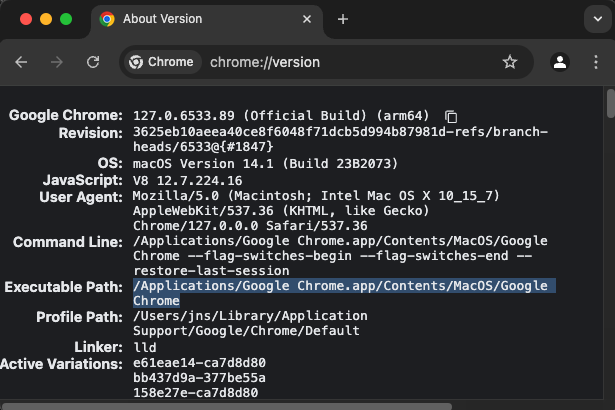

# Web Screenshot Capture

## Installation and Starting the Project

To set up and start the project, follow these steps:

1. Open a terminal and navigate to the root directory of the project.
2. Run the following command to install all the necessary dependencies:
   ```sh
   npm install
   ```
3. Configure the `CHROME_EXECUTABLE_PATH` environment variable:
- Open Google Chrome and navigate to `chrome://version`.
- Copy the value of `Executable Path`.
- Open the `.env` file located in the `app` directory.
- Update the `CHROME_EXECUTABLE_PATH` variable with the copied path, making sure to enclose the value in double quotes (`"`):
- Example: 
  - 
  - The `.env` file should look something like this:
    ```
    CHROME_EXECUTABLE_PATH="/Applications/Google Chrome.app/Contents/MacOS/Google Chrome"
    ```

4. Once the installation and environment configuration are complete, start the project by running: 
   ```sh
   npm start 
   ```

Executing these commands will install the required dependencies and start the project for development. This will simultaneously launch an Electron App and start a Node.js server
